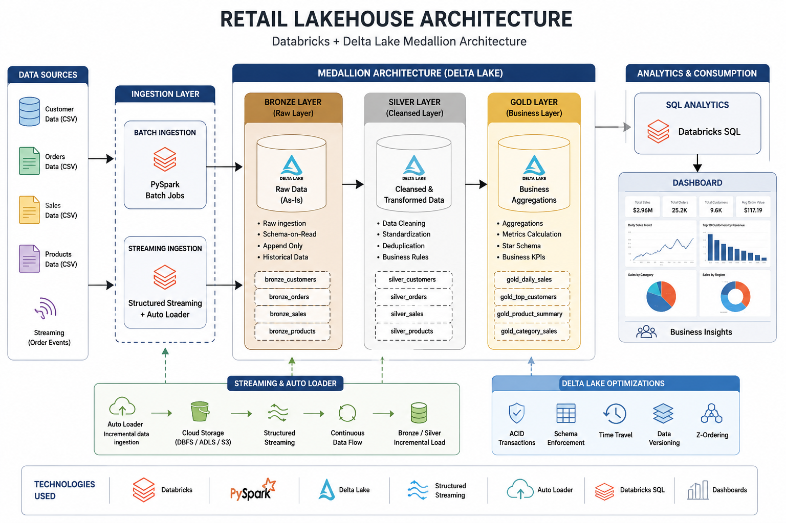

# Retail Lakehouse Architecture using Databricks & Delta Lake

## Overview

Built an end-to-end Retail Lakehouse solution using Databricks, Delta Lake, PySpark, Structured Streaming, Auto Loader, and SQL Analytics.

The project implements the Medallion Architecture (Bronze, Silver, Gold) to transform raw retail datasets into business-ready insights while supporting both batch and streaming workloads.

---

## Business Problem

Retail companies generate large volumes of customer, order, and sales data from multiple systems.

### Challenges

- Data quality issues
- Duplicate records
- Historical tracking of customer changes
- Real-time order ingestion
- Business reporting and KPI generation

This project solves these challenges through a scalable Lakehouse architecture.

---

## Architecture



---

## Technologies Used

- Databricks
- PySpark
- Delta Lake
- Structured Streaming
- Auto Loader
- SQL Analytics
- Unity Catalog
- Dashboard Visualization

---

## Medallion Architecture

### Bronze Layer

- Raw data ingestion
- Stores source data without modifications
- Creates Delta tables for reliable storage

### Silver Layer

- Data cleansing
- Deduplication
- Data quality improvements
- Business rule implementation

### Gold Layer

- Aggregated business metrics
- Customer analytics
- Product analytics
- Revenue reporting

---

## Key Features

### Delta Lake Operations

- Update
- Delete
- Merge
- Time Travel

### Streaming Pipeline

- Real-time order processing
- Structured Streaming
- Checkpointing support

### Auto Loader

- Incremental file ingestion
- Automatic schema detection
- Scalable data onboarding

### CDC SCD Type 2

- Historical customer tracking
- Change management
- Versioned records

### SQL Analytics

- Daily Sales Trend
- Top Customers Revenue
- Category Sales Distribution
- KPI Reporting

---

## Dashboard

- Total Revenue KPI
- Daily Sales Trend
- Top Customers Revenue
- Category Sales Distribution

---

## Project Workflow

```text
Retail Data Sources
        ↓
Bronze Layer
        ↓
Silver Layer
        ↓
Gold Layer
        ↓
SQL Analytics
        ↓
Dashboard
```

---

## Business Outcomes

- Improved data quality
- Automated ingestion process
- Real-time data processing
- Historical customer tracking
- Interactive business dashboards
